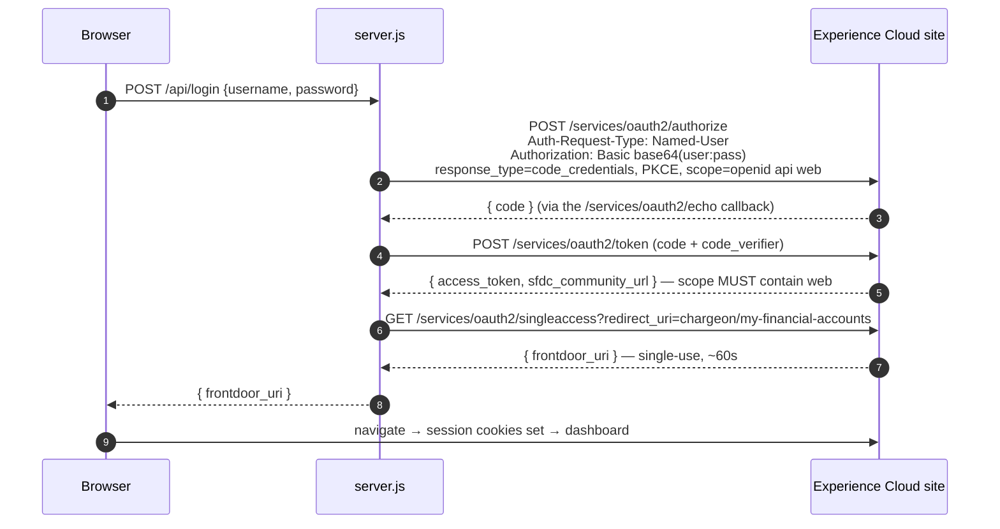

# Primary Capital — external marketing site

Static HTML/CSS/JS plus a small Node backend (`server.js`). **Not** Salesforce
metadata — deployed separately from `force-app` / `fsc-force-app`. "Client Login"
logs the visitor into the ChargeOn Payment Portal Experience Cloud site (branded
on-site as Primary Capital) using Salesforce's **Headless Identity API**, then
bridges that session into the real portal UI so the visitor lands on the
dashboard already logged in.

Reference: Salesforce ["Headless Identity Implementation
Guide"](https://developer.salesforce.com/docs/atlas.en-us.headless_identity.meta/headless_identity/headless_identity_login_overview.htm)
(Authorization Code and Credentials Flow) and ["Generate a Frontdoor URL to
Bridge into UI
Sessions"](https://help.salesforce.com/s/articleView?id=xcloud.frontdoor_singleaccess.htm&language=en_US&type=5)
(Single Access UI Bridge API). This is the documented use case for exactly this
scenario, not a workaround.

## Run locally

```
npm start
```

Runs `server.js` (plain Node, no dependencies, Node 18+ for global `fetch`) at
`http://localhost:5500`. Deploying this needs somewhere that can run a small Node
process or function (Vercel/Netlify function, small Node host) — not plain static
hosting.

## How login works

The **entire** Salesforce flow runs server-side in `server.js`. The browser posts
`{ username, password }` to `POST /api/login` and gets back one thing: a
single-use, ~1-minute `frontdoor_uri` to navigate to.



**Why it all lives server-side.** `/services/oauth2/singleaccess` does not support
CORS at all — it is not in Salesforce's [CORS-enabled OAuth endpoint
list](https://help.salesforce.com/s/articleView?id=sf.remoteaccess_oauth_endpoints_cors.htm&language=en_US&type=5)
— so a backend is mandatory regardless. Running the earlier steps here too means:
no CORS allowlist entry and no "Enable CORS for OAuth endpoints" switch (the
largest source of setup failures for this flow), the `web`-scoped access token
never reaches the browser, and no route accepts a client-supplied Salesforce host.

`frontdoor.jsp?sid=<access_token>` on its own does **not** work here (confirmed by
testing — it bounces back to login). `singleaccess` is the correct mechanism.

## Configuration (`server.js`, all overridable by env var)

| Constant | Default | Notes |
| --- | --- | --- |
| `SF_ORIGIN` | `https://app-computing-6782-dev-ed.scratch.my.site.com` | Origin only, no path |
| `SF_SITE_PATH` | `chargeon` | **Browsable** site prefix — see the warning below |
| `SF_CALLBACK_URL` | `<origin>/chargeonvforcesite/services/oauth2/echo` | Must match the app's registered Callback URL byte for byte |
| `SF_CLIENT_ID` | *(the scratch org's Consumer Key)* | |
| `SF_SCOPES` | `openid api web` | **Space**-separated. Every scope here must also be selected on the app |
| `SF_LANDING_ROUTE` | `my-financial-accounts` | The LWR route name |
| `SF_LANDING_PATH` | *(derived)* | Escape hatch — send an exact relative path instead |

### Counselling enquiry intake (`POST /api/enquiry`)

The application forms post here; the server relays them to the org's
`/services/apexrest/fsc/v1/enquiry`, which creates a `Counselling_Request__c`.

| Env var | Required? | Notes |
| --- | --- | --- |
| `SF_INTAKE_CLIENT_ID` | yes, for intake | Consumer Key of a **separate** External Client App using the **client-credentials** flow |
| `SF_INTAKE_CLIENT_SECRET` | yes, for intake | **A real secret.** Vercel env var only — never commit it |
| `RECAPTCHA_SECRET` | optional | Unset = reCAPTCHA not enforced. Set before this is public |
| `RECAPTCHA_MIN_SCORE` | optional | Defaults to `0.5` |

Use a different OAuth client from the login flow. That one is a named-user public
client that mints portal sessions; intake only ever needs to create one record, and
its integration user's permission set is scoped to exactly that.

Without these set, `/api/enquiry` answers 502 and the form shows
"We could not record your enquiry right now" — the site still runs.

## Pages

| Path | Form on it |
| --- | --- |
| `index.html` | General enquiry (`Request_Type__c = General Enquiry`) |
| `loans.html` | Loan application — `#loanType` values must stay byte-identical to Salesforce `Loan_Type__c` |
| `insurance.html` | Insurance application — `#insuranceType` matches `Insurance_Type__c`; the term is optional |

The picklist **values** (not labels) are what the rate tables match on. A mismatch
does not error — it silently prices the applicant at the default rate row.
`FscCounsellingRequestTest` asserts the two Salesforce objects agree; the website is
a third copy and has no test, so change all three together.

## Deploying

Vercel builds from `main` on this repo. `server.js` runs as the function and serves
the static files itself, so **every new static file must be listed in
`vercel.json` → `includeFiles`** or it 404s in production while working locally.

```bash
git add -A && git commit -m "..." && git push origin main
```

Set the env vars above in the Vercel project settings, not in the repo.

### ⚠️ The site path prefix is not what the Network metadata says

The Network's `<urlPathPrefix>` is `chargeonvforcesite`, but that belongs to the
companion **Visualforce-hosting** site. The browsable LWR portal is under the
short form. Verified live against this org:

```
GET /chargeonvforcesite/            -> 301 to /chargeon/
GET /chargeon/my-financial-accounts -> 200  (the real route)
GET /chargeon/login                 -> 200  (the real login page)
```

Both prefixes serve the OAuth endpoints, but only `chargeon/<route>` is a real LWR
route — so that is what the bridge's `redirect_uri` must use. `server.js` derives
the landing path from the `sfdc_community_url` Salesforce returns in the token
response and folds a trailing `vforcesite` away, so it stays correct either way.

## Headless Login setup

### 1. Apex prerequisite (already deployed)
`FscHeadlessUserDiscoveryHandler` (in `fsc-force-app/main/default/classes/`) is
deployed to `BFSI_Org`. Salesforce's Login & Registration page requires a
discovery handler registered before it lets you save at all, once any Headless
Identity flow is touched — even though this plain username-password flow never
invokes it (it always gets an exact username, not a login hint).

### 2. Site: Login & Registration page
Setup → Digital Experiences → ChargeOn Payment Portal → Administration →
Login & Registration:
- **OAuth 2.0 for First-Party Applications** → check **"Allow off-platform apps to
  access the OAuth 2.0 authorization challenge endpoint."**
- **Headless User Discovery** → User Discovery Handler →
  `FscHeadlessUserDiscoveryHandler`.
- **Headless Username-Password Login** → "Require reCAPTCHA..." left **unchecked**
  for now (see "Known limitation" below).
- Save.

Also confirm the site's **Status is Active** (Setup → Digital Experiences → All
Sites). External users cannot log in to a site left in `UnderConstruction`.

### 3. Org-wide: enable the OAuth flow
Setup → Quick Find → **OAuth and OpenID Connect Settings** → turn on **"Allow
Authorization Code and Credentials Flows."**

### 4. Connected App / External Client App
(Newer orgs create **External Client Apps** instead of classic Connected Apps by
default — same settings, different UI: app name → **Settings → OAuth Settings**.)

- Enable OAuth Settings.
- Callback URL: `https://<origin>/chargeonvforcesite/services/oauth2/echo` —
  whatever you register here must be what `SF_CALLBACK_URL` sends, exactly, or
  Salesforce answers `redirect_uri_mismatch`.
- Scopes: **Access unique user identifiers (openid)** + **Manage user data via
  APIs (api)** + **Allow access to your data via the Web (web)**.
  **`web` is mandatory** — `/services/oauth2/singleaccess` rejects any token
  without `web` or `full` (`Invalid_Scope`). Prefer `web` over `full`; `full`
  encompasses `web` but grants far more than this flow needs.
- **Uncheck** "Require Secret for Web Server Flow" and "Require Secret for Refresh
  Token Flow" (this is a public client).
- Check **"Enable Authorization Code and Credentials Flow"**, and leave **"Require
  user credentials in the POST body" unchecked** — `server.js` sends the
  credentials in the `Authorization: Basic` header. If that box is checked the
  header is ignored, the request stops being treated as headless, and Salesforce
  returns an HTML login page instead of an authorization code.
- Leave **"Issue JSON Web Token (JWT)-based access tokens" off** — JWT-based
  access tokens break opening the Experience Cloud site from the bridge.
- Enable **"Require Proof Key for Code Exchange (PKCE)"** — `server.js` always
  sends a `code_challenge`.
- **Manage → Edit Policies**: Permitted Users = "Admin approved users are
  pre-authorized"; under **Manage Profiles** add the portal's end-user profile
  (Customer Community Plus Login User) so users aren't shown a consent screen.
  Without this you get `user hasn't approved this consumer`.
- **OAuth Settings → Consumer Key and Secret → Manage Consumer Details** → copy
  the **Consumer Key** into `SF_CLIENT_ID`.

> **Connected app changes take up to ~10 minutes to propagate.** Retesting
> immediately after a scope change gives stale results — this is the single
> biggest source of confusing, inconsistent test outcomes here.

### 5. CORS — not required
Nothing in this flow is called from browser JS any more, so no Allowed Origins
entry and no "Enable CORS for OAuth endpoints" switch are needed. (This also puts
the site back in line with the repo-wide rule that all Salesforce REST traffic is
server-to-server.)

### 6. The end user
Must be a member of the ChargeOn Payment Portal network, must **not** have the
**API Only User** permission (`singleaccess` returns `Bad_OAuth_Token` if they
do), and must not be subject to MFA or an Experience Cloud login flow — plain
headless username-password login cannot complete either of those.

## Troubleshooting

`server.js` logs each step and surfaces Salesforce's own error text.

| Symptom | Cause |
| --- | --- |
| Salesforce returns an **HTML login page** from `/authorize` | The request stopped being treated as headless. A scope in `SF_SCOPES` is not selected on the app, "Require user credentials in the POST body" is checked, or "Allow Authorization Code and Credentials Flows" is off. |
| `redirect_uri_mismatch` | `SF_CALLBACK_URL` doesn't exactly match the app's registered Callback URL. |
| `invalid_grant` / `authentication failure` | Wrong username or password. |
| Token issued with scope lacking `web` | The `web` scope isn't on the app (or the change hasn't propagated). `server.js` fails with an explicit message here rather than letting the next step return a cryptic `Invalid_Scope`. |
| `Invalid_Scope` from `singleaccess` | Same cause as above. |
| `Invalid_Param` from `singleaccess` | `redirect_uri` was absolute, or otherwise not a valid relative path. |
| `Bad_OAuth_Token` | Token expired, or the user has the API Only User permission. |
| `No_Access` / `Wrong_Org` | `singleaccess` was called on a different domain than the one that issued the token. |
| Bridge succeeds but lands on "Invalid Page" / 404 | The `startURL` isn't a real route. Prefix must be `chargeon` (not `chargeonvforcesite`) and there must be **no** `/s/` segment. |
| Bridge worked once, then stopped | `frontdoor_uri` is single-use and expires in ~1 minute. |

## Known limitations

- **reCAPTCHA** is currently disabled for the login flow (step 2). Before
  production, re-enable it and add Google reCAPTCHA v3 (a `recaptcha` token in the
  `/authorize` request body, by analogy with the guide's Registration and Forgot
  Password flows — not yet confirmed for plain login specifically).
- **MFA and login flows are not supported** by plain headless username-password
  login.
- **Password collection on a third-party domain.** This design has visitors type
  Salesforce portal credentials into a non-Salesforce page. The lower-risk
  alternative Salesforce recommends for Experience Cloud is federated SSO — the
  external site as an OIDC/SAML IdP behind a Salesforce Auth Provider. Worth
  revisiting before this goes to real customers.
- **None of the org-side config is in source control** — the connected app exists
  only in `BFSI_Org`, which is a scratch org expiring **2026-08-20**.

## Site domain reference (BFSI_Org scratch org, current)

- Guest home: `https://app-computing-6782-dev-ed.scratch.my.site.com/chargeon/`
- Dashboard: `https://app-computing-6782-dev-ed.scratch.my.site.com/chargeon/my-financial-accounts`

This is a scratch org — the domain differs per environment and changes again once
this points at a real production org or custom domain.
# Primary-Capital
